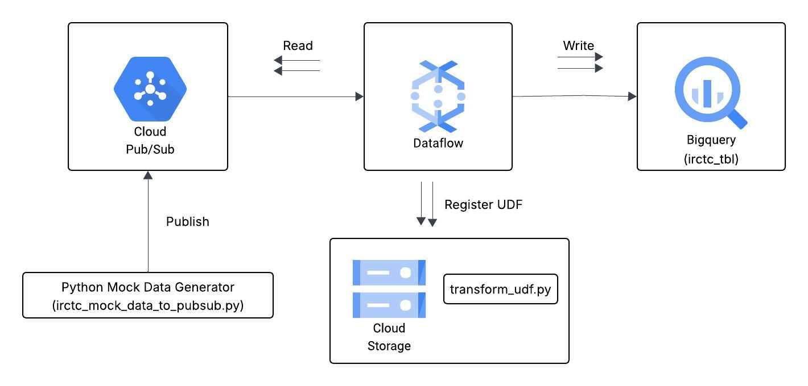

# IRCTC Streaming Data Ingestion Project 

## Introduction
This industrial project builds a real-time data pipeline to ingest IRCTC train reservation data using Google Cloud Platform. Mock data is published to Pub/Sub, transformed by a Dataflow pipeline using a Python UDF stored in Cloud Storage, and finally written into BigQuery for real-time analysis and reporting.

## Architecture

## Technology Used
1. Programming language - Python
2. Scripting Language - SQL
3. Google Cloud Platform
   - BigQuery
   - Cloud Storage
   - Pub/Sub
   - Dataflow
  
## Source Data
A Python mock data generator that publishes passenger related data such as name, age, email, join date, loyalty points, account balance, is active, loyalty status, account age days into Pub/Sub.
  
## Scripts for the Project
1. [Data-Publish Python File](irctc_mock_data_to_pubsub.py)
2. [Data Transform Python File](irctc_mock_data_to_pubsub.py)

